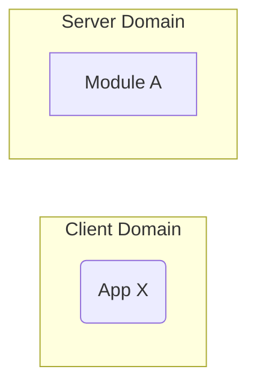

# Software Design Document (SDD) - `votive-web`

:exclamation: This document is intended for internal use.

## :telescope: Overview

This document details the software implementation of :construction:.

This process is responsible for :construction:

## :books: Related Documents

Document | Description
--- | ---
:construction: Requirements & User Stories - `votive-web` :construction: | Requirements and user stories
[Concept of Operations (CONOPS) - `votive-web`](./conops.md) | Module overview
[Interface Control Document (ICD) - `votive-web`](./icd.md) | Overview of this module's inputs and outputs
:construction: High-Level Interface Control Document (ICD) :construction: | Interfaces shared by all microservices.
## Module Attributes

Attribute | Applies | Explanation
--- | --- | ---

## :globe_with_meridians: Global Variables

:construction:

## :robot: Logic

### :seedling: Initialization

:construction:

### :recycle: Control Loop

:construction:

### :broom: Cleanup

:construction:

## :handshake: Interfaces

:construction: description of the graph.

## :heavy_check_mark: Tests

:construction:

### :tulip: Unit Tests

:construction:

### :bouquet: Integration Tests

:construction:
